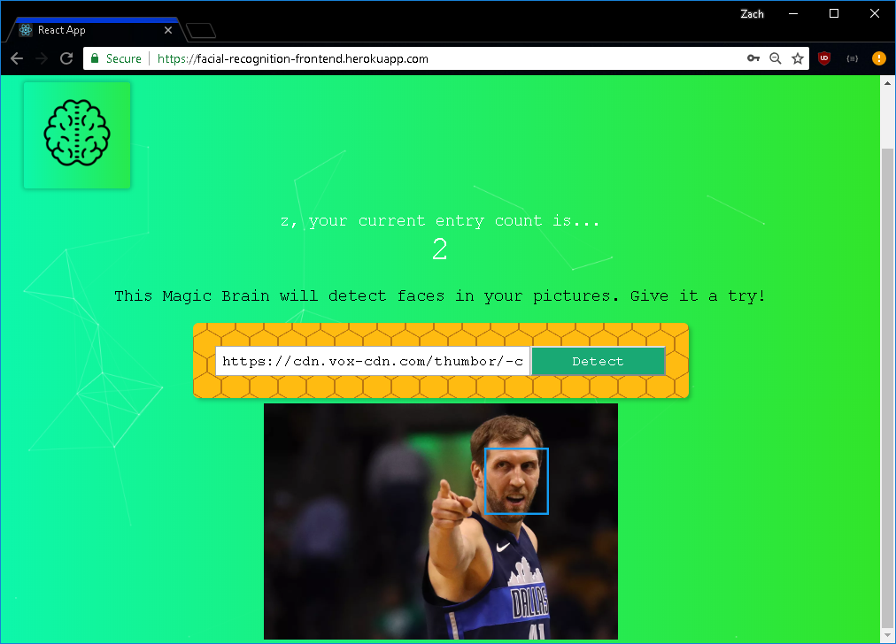

## Face Recognition App

[Test face recognition app here!](https://facial-recognition-frontend.herokuapp.com/)
(loading can take a minute to load)

This application uses the PERN stack and uses an API from Clarifai to detect faces on a picture. It can register new users and store them to a database so they can login whenever. The Node+Express.js backend server listens for the front end and for HTTP requests from the front end. The server handles the requests and interacts with postgreSQL Heroku database based off of those requests such as registering new users or checking login information to allow or deny access to the user. The database holds all the user information. The server can be found [here] (https://github.com/zs1046/ServerAPI). All three components are running on Heroku. More work to be done.

## Work needed
- Add detection for multiple faces
- Fix background
- Face detection broke for some reason

